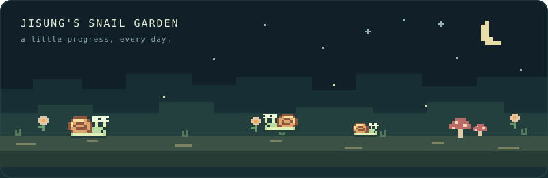

# 👋 안녕하세요, 채지성입니다!

**Software Engineer · Backend, Security & Networks**

보안, 네트워크, 서버 개발에 관심이 있습니다.

## 💼 Experience

| 기간 | 소속 · 역할 |
| :--- | :--- |
| 2026.01 — 현재 | AlpacaX · 정규직 · Software Engineer · 백엔드팀 |
| 2025.06 — 2025.12 | AlpacaX · 계약직 · 백엔드팀 |
| 2024.12 — 2025.06 | AlpacaX · 인턴 · 백엔드팀 · 학교 현장실습 |

## 🎓 Education

**경희대학교 컴퓨터공학과** `2021.03 — 2026.08` 
졸업 · GPA 3.797 / 4.3 (4.08 / 4.5)

## 📄 Publications

- **VoLTE 단말 IMS 환경에서의 SIP 기반 취약점 탐지를 위한 Over-the-Air 블랙박스 퍼징 시스템** 
  **채지성** · 박철준(경희대학교) · 제1저자 
  2026 한국컴퓨터종합학술대회(KCC2026) · 정보보안및고신뢰컴퓨팅 · P8.5-09 
  [공식 논문집](https://kcc2026.kiise.or.kr/Proceedings/SessionSearch.asp?SrchText=%EC%B1%84%EC%A7%80%EC%84%B1) · [최우수상 수상 안내](https://swedu.khu.ac.kr/bbs/board.php?bo_table=07_02&wr_id=601)

## 🏆 Awards & Scholarships

- KCC2026 학부생부문 최우수상 — 한국정보과학회 · 제1저자 
  VoLTE 단말 IMS 환경에서의 SIP 기반 취약점 탐지를 위한 Over-the-Air 블랙박스 퍼징 시스템
- 국가우수이공계 장학생 — 한국장학재단 · 재학 중 우수자
- 송정농업협동조합 지역인재 장학생 — 2024년 2학기
- Blaybus MVP 해커톤 최우수상 — 치매 환자용 알약 디스펜서 앱·서버 개발
- 경기도 평화 두드림 청년 아이디어톤 우수상 — 탈북 청년의 사회 정착을 돕는 커뮤니티 플랫폼 기획

## 📜 Qualifications

- TOPCIT 수준 4
- 정보처리기사
- SQLD

## 🤝 Activities

- **주니어 스칼라 학부연구 프로그램** · 12주 · VoLTE/IMS 환경의 SIP 변이 퍼저 설계·구현
- **2025.03 — 2025.06** · 경희대학교 운영체제 SW멘토
- **2025.03 — 2025.06** · RETURN 신입생 Python 교육
- **2024.09 — 2024.12** · 경희고등학교 C++ 교육 멘토
- **2024.08 — 2024.12** · GIST 창업팀 STS · Spring 백엔드 개발 · 치매 환자용 알약 디스펜서 서버 개발
- **2024.03 — 2024.08** · 학술동아리 RETURN 회장
- **2022.03 — 2022.07** · 학술동아리 RETURN 부회장

## 🛠 Tech Stack

##### Programming Languages

##### Backend

##### Database

##### Infra

##### Network

TCP · WebSocket · gRPC · SIP/IMS

##### Research & Experiments

Open5GS · srsRAN · Kamailio

## 🚀 Selected Projects

| 프로젝트 | 소개 | 기술 |
| :--- | :--- | :--- |
| **[SIP Mutation Fuzzer](https://github.com/jisung-02/sip-mutation-fuzzer)** | VoLTE/IMS 환경에서 SIP 메시지를 변형해 단말 취약점을 탐지하는 퍼징 시스템 | Python · Open5GS · srsRAN · Kamailio |
| **[RCP](https://github.com/KHU-RETURN/rcp-server)** | 동아리 구성원을 위한 OpenStack 기반 사설 클라우드 플랫폼 | Go · Gin · ent · OpenStack |
| **NUVO** | 전화 상황을 연습하는 AI 통화 트레이닝 서비스 | Python · gRPC · LangGraph · Kotlin/Spring · Elixir |
| **[Aether](https://github.com/jisung-02/aether)** | Gleam으로 작성한 서버 프레임워크와 학습용 네트워킹 스택 | Gleam · Erlang/BEAM · TCP/UDP · HTTP |
| **[KHU NLP Lab](https://github.com/jisung-02/nlp-lab)** | 연구실 구성원·논문·소식과 관리자 콘텐츠 편집 기능을 갖춘 [연구실 홈페이지](https://nlp.khu.ac.kr/) | Python · FastAPI · Jinja2 · SQLModel |
| **[AI Routing Lab](https://github.com/jisung-02/ai-routing-lab)** | eBPF 네트워크 지표와 성능 예측으로 경로 선택 전략을 비교하는 수업 프로젝트 | Python · Linux · eBPF · scikit-learn |
| **[webdesktopmcp](https://github.com/jisung-02/webdesktopmcp)** | Electron·Tauri·Wails 데스크톱 앱에 WebMCP를 연동하는 실험적 브리지 | TypeScript · Rust · Go · WebMCP |

## 🧰 Tools I Build & Use

직접 만들어 개발과 일상에 사용하는 도구들입니다.

| 도구 | 용도 |
| :--- | :--- |
| **[채집 · Chaejip](https://github.com/jisung-02/Chaejip)** | 웹 페이지와 로컬 카카오톡 대화를 수집·검색하는 MCP 서버 |
| **[오르비 · orbi](https://github.com/jisung-02/orbi)** | 터미널·포모도로·파일 선반·시스템 모니터를 모아둔 macOS 데스크톱 위젯 |

## 🔍 Security Research & Open Source

**Ash Framework · 취약점 제보 3건**

| Advisory | 내용 |
| :--- | :--- |
| [CVE-2026-67579](https://github.com/ash-project/ash/security/advisories/GHSA-3gq3-9xm3-c8v3) | 키셋 커서의 필터 표현식 주입 — 데이터 계층에 따라 SQL 인젝션 또는 코드 실행 |
| [CVE-2026-69659](https://github.com/ash-project/ash/security/advisories/GHSA-j35q-v8h8-7mwq) | 키셋 커서 역직렬화에 의한 메모리 고갈 |
| [CVE-2026-70395](https://github.com/ash-project/ash/security/advisories/GHSA-vvp6-3wv6-833j) | 관계 조회 조건 주입에 의한 비밀 조회 키 노출 |

**Bandit · [PR #626](https://github.com/mtrudel/bandit/pull/626)** 
Elixir HTTP 서버의 헤더 파싱에서 반복 연산과 옵션 조회를 줄이는 개선 PR을 작성해 병합했습니다.

## 📈 GitHub Stats

  

